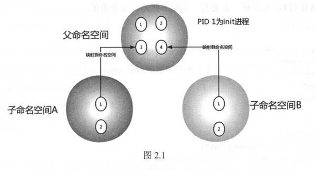

# Chapter 2: The Basics
## 1. Linux Namespace

* User ID level isolation, user 1 with UID=n has root access in virtual namespace

* PID can be virtualized as well. Different namespaces have their own init process (PID=1). Processes in child NS are mapped onto parent NS; parent NS aware of child NS processes; different child NSs are isolated.



* API:

    * ```clone()```: create new process, arg specifies which NS to create

    * ```unshare()```: move process out of NS

    * ```setns()```: move process into NS

<br>

1. UTS Namespace:

    Isolates nodename and domainname. In UTS NS, every NS is allowed to have its own hostname.

    ex: [uts_namespace.go](../code/chapter2/uts_namespace.go)

2. IPC Namespace:

    Isolates System V IPC and POSIX message queues, every NS has its own System V IPC and POSIX message queue.

    ex: [ipc_namespace.go](../code/chapter2/ipc_namespace.go)

3. PID Namespace:

    Isolates PID. A process has different PIDs in different NSs.

    ex: [pid_namespace.go](../code/chapter2/pid_namespace.go)

4. Mount Namespace:

    Isolates mount points that processes can see. ```mount()``` and ```umount()``` in mount NS only affects FS within NS.

    ex: [mount_namespace.go](../code/chapter2/mount_namespace.go)

5. User Namespace:

    Isolates user and group id. UID and GID of a process can be different inside/outside a container. I.E. root access inside NS, no root access outside NS.

    ex: [user_namespace.go](../code/chapter2/user_namespace.go)

6. Network Namespace

    Isolates network stack (network device, IP addr/port, etc.). Enables each container to have its own (virtual) network device; applications able to bind to ports. Ports across containers don't conflict. Bridge in host enables communication between containers.

    ex: [network_namespace.go](../code/chapter2/network_namespace.go)

## 2. Linux Cgroups

* Controls and monitors resources of processes.

* One **cgroup** contains a number of processes as well as a set of Linux subsystem parameters.

* A **subsystem** includes:
    * blkio (IO control)
    * cpu (policy for process scheduling)
    * cpuacct (cpu usage of processes)
    * cpuset (cpu and mem available in multicore machine)
    * devices (process access to devices)
    * freezer (to resume and suspend process in cgroup)
    * memory (controls mem usage)
    * net_cls (classifies network packets, for Linux traffic controller to regulate)
    * net_prio (sets network traffic priority of process in cgroup)
    * ns (when process forks a new process, create new cgroup, which contains processes in new NS)

* **Hierarchy** is a tree which connects cgroups, which enables inheritance.

* Kernel interactions:

    Uses directory trees to emulate hierarchy/ cgroup tree

    * ```cgroup.clone_children``` determines whether child cgroup will inherit parent cgroup's cpuset
    * ```cgroup.procs``` has the PIDs of all processes in this node
    * ```notify_on_release``` notes if ```release_agent``` (essentialy a path) is executed when the last process of a cgroup exits
    * ```tasks``` labels the PIDs of this cgroup

* One process can only be on one node of a cgroups hierarchy.

* How docker uses cgroups:

    Each container corresponds to a cgroup

* ex: [cgroup_demo.go](../code/chapter2/cgroup_demo.go)

## 3. Union File System

* Uses copy-on-write. If a resource is redundant and unmodified, then it can be shared by new and old instances. The first write trigger a duplication.

* AUFS (Advanced Multi-layered Unification File System)

* How Docker uses AUFS:

    * Image layer and AUFS:

        Each Docker image is composed of a series of read-only layers, which are stored in ```/var/lib/docker/aufs/diff```. ```/var/lib/docker/aufs/layers``` holds metadate about how the layers are stacked.

    * Container layer and AUFS:

        When initializing a container, Docker creates a read-only init layer to store info about the environment inside the container as well as a read-write layer to execute write actions. Container layers are mounted at ```/var/lib/docker/mnt```. Container metadata and config files are stored at ```/var/lib/docker/containers/<container-id>```, and read-write layers are stored at ```/var/lib/docker/aufs/diff```. When a container is stopped, the r-w layer still exists so that data is preserved after restarting the container. Only when a container is deleted is the r-w layer deleted.

        Deleting files in a container under AUFS: to delete ```file1```, AUFS creates a ```.wh.file1``` in the container's r-w layer to hide ```file1``` of all r-w layers.

* ex:
    ```console
    $ cd ../code/chapter2/aufs

    $ ls
    container-layer  image-layer1  image-layer2  image-layer3  image-layer4  mnt

    $ cat container-layer/container-layer.txt
    I am a container layer

    $ cat image-layer1/image-layer1.txt
    I am image layer 1

    $ cat image-layer1/image-layer2.txt
    I am image layer 2

    $ cat image-layer1/image-layer3.txt
    I am image layer 3

    $ cat image-layer1/image-layer4.txt
    I am image layer 4

    # mount the 5 layers onto mnt using AUFS
    # first directory after dirs has r-w permissions, all other directories are read-only
    $ sudo mount -t aufs -o dirs=./container-layer:./image-layer4:./image-layer3:./image-layer2:./image-layer1 none ./mnt

    $ tree mnt
    mnt
    ├── container-layer.txt
    ├── image-layer1.txt
    ├── image-layer2.txt
    ├── image-layer3.txt
    └── image-layer4.txt

    # check permission of newly mounted directories
    $ cat /sys/fs/aufs/si_3cf355c9db8b9be8/*
    /home/haiyang/project/mydocker/code/chapter2/aufs/container-layer=rw
    /home/haiyang/project/mydocker/code/chapter2/aufs/image-layer4=ro
    /home/haiyang/project/mydocker/code/chapter2/aufs/image-layer3=ro
    /home/haiyang/project/mydocker/code/chapter2/aufs/image-layer2=ro
    /home/haiyang/project/mydocker/code/chapter2/aufs/image-layer1=ro
    64
    65
    66
    67
    68
    /home/haiyang/project/mydocker/code/chapter2/aufs/container-layer/.aufs.xino

    $ echo -e "\nwrite to mnt's image-layer1.txt" >> ./mnt/image-layer4.txt

    # the mounted file is modified
    $ cat ./mnt/image-layer4.txt
    I am image layer 4

    write to mnt's image-layer1.txt

    # the original is not
    $ cat image-layer4/image-layer4.txt
    I am image layer 4

    # when writing to mnt/image-layer4.txt. the system first checks for the file under mnt and copies it to container-layer which has r-w permissions and modifies the copied file
    $ la container-layer/
    container-layer.txt  image-layer4.txt  .wh..wh.aufs  .wh..wh.orph  .wh..wh.plnk

    $ cat container-layer/image-layer4.txt
    I am image layer 4

    write to mnt's image-layer1.txt
    ```
