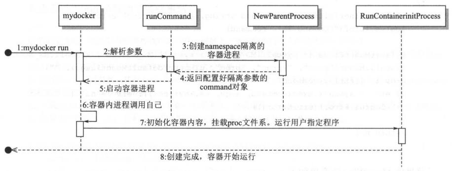
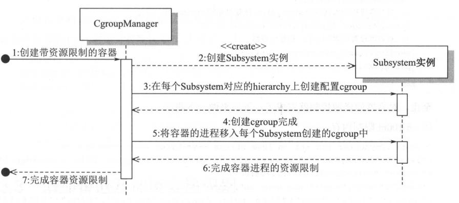
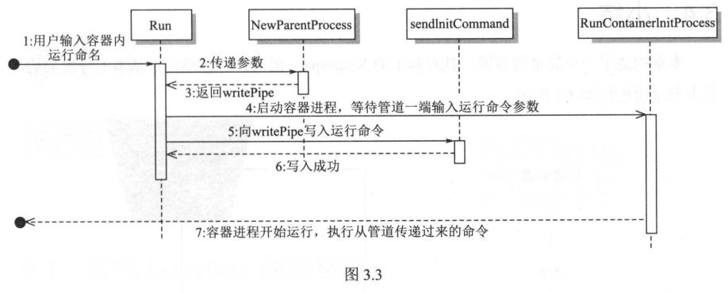
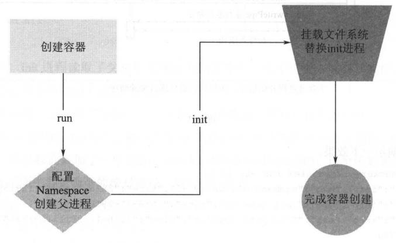

# Chapter 3: Creating a Container

## 1. Creating a Container with run Command

* The goal is to realize a simple run command, similar to ```docker run -ti [commnad]```.

* Code structure:

    ```console
    mydocker/
    ├── container
    │   ├── container_process.go
    │   └── init.go
    ├── Godeps
    │   ├── Godeps.json
    │   └── Readme
    ├── main_command.go
    ├── main.go
    ├── mydocker
    ├── run.go
    └── vendor
    ```

* MountFlag

    * ```MS_NOEXEC```: running other programs in this fs is not allowed
    * ```MS_NOSUID```: cannot set user-ID or group-ID while running a process in this fs
    * ```MS_NODEV```: all mount systems must set this since Linux kernel 2.4

* ```syscall.Exec``` calls kernel's ```int execve(const char *filename, char *const argv[], char *const envp[]);```, which executes a binary with the name ```filename``` and overwrites the image, data, heap/stack of the current process, including the PID. This essentially substitutes the init process. Inside the container, the first process will be what we specify, instead of init.

* Program flow:



* Test (with root access):

    ```console
        $ go build -o mydocker .

        $ ./mydocker run -ti /bin/sh
        {"level":"info","msg":"init come on","source":"3.1/main_command.go:51","time":"2018-07-11T17:41:06+08:00"}
        {"level":"info","msg":"command /bin/sh","source":"3.1/main_command.go:53","time":"2018-07-11T17:41:06+08:00"}
        {"level":"info","msg":"command /bin/sh","source":"container/init.go:17","time":"2018-07-11T17:41:06+08:00"}
        # ps -ef
        UID        PID  PPID  C STIME TTY          TIME CMD
        root         1     0  0 17:41 pts/18   00:00:00 /bin/sh
        root         6     1  0 17:41 pts/18   00:00:00 ps -ef
        # exit

        $ ./mydocker run -ti /bin/ls
        {"level":"info","msg":"init come on","source":"3.1/main_command.go:51","time":"2018-07-11T17:41:21+08:00"}
        {"level":"info","msg":"command /bin/ls","source":"3.1/main_command.go:53","time":"2018-07-11T17:41:21+08:00"}
        {"level":"info","msg":"command /bin/ls","source":"container/init.go:17","time":"2018-07-11T17:41:21+08:00"}
        container  main_command.go  main.go  mydocker  run.go
    ```

## 2. Adding Resource Restrictions

* Use cgroup to control the container's resources

* The goal is to use ```mydocker run -ti -m 100m -cpuset 1 -cpushare 512 /bin/sh``` to control the container's memory and cpu config.

* ```CgroupManager``` passes all operations (configure resource limits, move processes into cgroup, etc) to each subsystem to handle.

* Program Flow:

    * ```CgroupManager``` first initializes Subsystem instances, and calls every ```Set()``` of every instance to create and configure differenty hierarchies mounted by different Subsystems. Finally it adds the processes in the container to the cgroups.

    

* After initialization, add container process to each crgoup under each subsystem.

## 3. Adding Pipes and Environmental Variables Detection

* Pipes are tunnels that connect two processes. It is a method that Linux uses for IPC. Pipes are usually semi-bidirectional: one end writes and the other reads.

    * Unamed pipes are usually used between process with parent-child relationship

    * Named pipes (or FIFO pipes) are used in the file system, and can be accessed by two processes without any relationship. Named pipes are created using ```mkfifo()```

    * Pipes are essentially files. The difference is that pipes have a fixed size buffer, usually 4KB. The writer is blocked when the pipe is full, until a reader consumes the data in the pipe. A reader is also blocked when it sees an empty pipe, until a writer writes into the pipe.

    * runC uses anonymous pipe for parent and child process to communicate arguments.

* Program flow:

    

## 4. Test memory usage(with root access):

* Testing Memory:

    ```console
    $ ./mydocker run -ti -m 500m stress --vm-bytes 1000m --vm-keep -m 1
    {"level":"info","msg":"init come on","source":"3.2/main_command.go:71","time":"2018-07-13T11:45:49+08:00"}
    {"level":"info","msg":"complete command is stress --vm-bytes 1000m --vm-keep -m 1","source":"3.2/run.go:44","time":"2018-07-13T11:45:49+08:00"}
    {"level":"info","msg":"Find path /usr/bin/stress","source":"container/init.go:34","time":"2018-07-13T11:45:49+08:00"}
    stress: info: [1] dispatching hogs: 0 cpu, 0 io, 1 vm, 0 hdd
    ```

    * 500M/8G is around 5-6%

    ```console
    $ top
    top - 11:46:24 up 20:37,  1 user,  load average: 1.24, 0.77, 0.52
    Tasks: 272 total,   1 running, 203 sleeping,   0 stopped,   1 zombie
    %Cpu(s):  0.3 us,  2.1 sy,  0.0 ni, 87.4 id,  9.9 wa,  0.0 hi,  0.3 si,  0.0 st
    KiB Mem :  8073368 total,  2342396 free,  2923276 used,  2807696 buff/cache
    KiB Swap:  8294396 total,  7690056 free,   604340 used.  4640528 avail Mem

    PID USER      PR  NI    VIRT    RES    SHR S  %CPU %MEM     TIME+ COMMAND
    9815 root      20   0 1031484 422028    276 D  16.3  5.2   0:07.29 stress
    ```

* Testing CPUShare:
    * Use ```taskset -c <coreid>``` to pin the two processes to the same core

    * Terminal 1:

        ```console
        $ taskset -c 0 nohup stress --vm-bytes 200M --vm-keep -m 1 &
        [1] 11649
        nohup: ignoring input and appending output to 'nohup.out'
        ```

    * Terminal 2:
        ```console
        $ ./mydocker run -ti --cpushare 512 taskset -c 0 stress --vm-bytes 200m --vm-keep -m 1
        {"level":"info","msg":"complete command is taskset -c 0 stress --vm-bytes 200m --vm-keep -m 1","source":"3.2/run.go:44","time":"2018-07-13T12:09:50+08:00"}
        {"level":"info","msg":"init come on","source":"3.2/main_command.go:71","time":"2018-07-13T12:09:50+08:00"}
        {"level":"info","msg":"Find path /usr/bin/taskset","source":"container/init.go:34","time":"2018-07-13T12:09:50+08:00"}
        stress: info: [1] dispatching hogs: 0 cpu, 0 io, 1 vm, 0 hdd
        ```

    *   36.2/63.5 is roughly 1/2

        ```console
        $ top
        Tasks: 287 total,   4 running, 214 sleeping,   0 stopped,   1 zombie
        %Cpu(s): 13.6 us,  0.2 sy,  0.0 ni, 86.0 id,  0.1 wa,  0.0 hi,  0.1 si,  0.0 st
        KiB Mem :  8073368 total,  2038236 free,  3201100 used,  2834032 buff/cache
        KiB Swap:  8294396 total,  8291324 free,     3072 used.  4353124 avail Mem

        PID USER      PR  NI    VIRT    RES    SHR S  %CPU %MEM     TIME+ COMMAND
        11651 root      20   0  212288 204932    276 R  63.5  2.5   0:25.45 stress
        11667 root      20   0  212284 204920    276 R  36.2  2.5   0:05.00 stress
        ```
* Program overview:

    