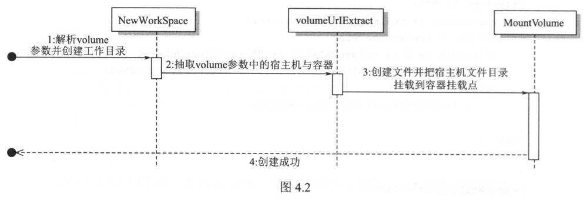
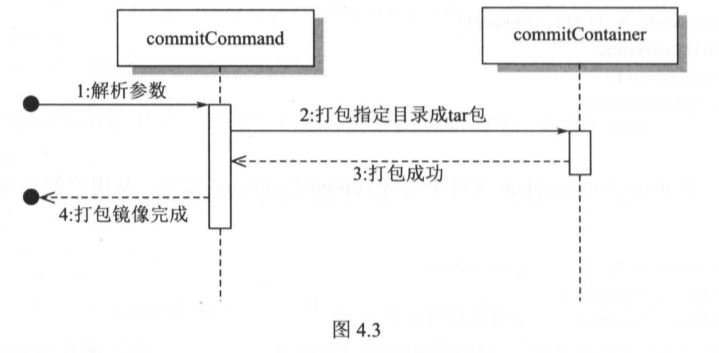

# Chapter 4: Creating an Image

## 1. Use busybox to create containers

* The goal is to run our container in an image environment.

* busybox

    * busybox is a collection of UNIX tools.

    * To get the rootfs of busybox"

        ```console
        $ docker pull busybox
        $ docker run -d busybox top -b
        $ docker export -o busybox.tar c6aea0159724 (container ID)
        $ tar -xvf busybox.tar -C /root/busybox/
        ```

* ```pivot_root```

    * ```pivot_root``` is a syscall that changes the current root directory. It moves the current root directory into put_old and uses new_root as the new rootfs. new_root and put_old cannot be in the same file system as the current root. The difference between ```chroot``` and ```pivot_root``` is that, ```pivot_root``` switches the whole system onto a new root directory and removes dependency of the previous rootfs; and ```chroot``` targets a specific process, other process are still in the old rootfs environment.base

    * ```tmpfs``` is a RAM-based file system, and uses RAM or swap partition for storage. We will put busybox under the host's ```/root/busybox``` using "```cmd.Dir = "/root/busybox"```" in ```./container/container_process.go``` to initialize a starting working dirctory for the child process running the container, and ```/root/busybox``` will be used as the new rootfs.

* Test:

    ```console
    $ sudo ./mydocker -ti sh
    {"level":"info","msg":"init come on","source":"4.1/main_command.go:71","time":"2018-07-16T15:11:08+08:00"}
    {"level":"info","msg":"complete command is sh","source":"4.1/run.go:46","time":"2018-07-16T15:11:08+08:00"}
    {"level":"info","msg":"Current location is /root/busybox","source":"container/init.go:61","time":"2018-07-16T15:11:08+08:00"}
    {"level":"info","msg":"bind mounted /root/busybox","source":"container/init.go:87","time":"2018-07-16T15:11:08+08:00"}
    {"level":"info","msg":"pivot_root to /root/busybox, old root at /root/busybox/.pivot_root","source":"container/init.go:102","time":"2018-07-16T15:11:08+08:00"}
    {"level":"info","msg":"unmounted /.pivot_root","source":"container/init.go:113","time":"2018-07-16T15:11:08+08:00"}
    {"level":"info","msg":"removed /.pivot_root","source":"container/init.go:119","time":"2018-07-16T15:11:08+08:00"}
    {"level":"info","msg":"Find path /bin/sh","source":"container/init.go:35","time":"2018-07-16T15:11:08+08:00"}
    ```

    * the current working directory in the container has be redirected to ```/```, which is ```/root/busybox``` on the host

    ```console
    / # pwd
    /
    / # ls -l
    total 40
    drwxr-xr-x    2 1000     1000         12288 May 22 17:00 bin
    drwxr-xr-x    2 root     root            40 Jul 16 07:11 dev
    drwxr-xr-x    3 1000     1000          4096 Jul 16 02:26 etc
    drwxr-xr-x    2 1000     1000          4096 May 22 17:00 home
    dr-xr-xr-x  273 root     root             0 Jul 16 07:11 proc
    drwx------    2 1000     1000          4096 May 22 17:00 root
    drwxr-xr-x    2 1000     1000          4096 Jul 16 02:26 sys
    drwxrwxr-x    2 1000     1000          4096 May 22 17:00 tmp
    drwxr-xr-x    3 1000     1000          4096 May 22 17:00 usr
    drwxr-xr-x    4 1000     1000          4096 May 22 17:00 var
    ```

    * ```mount``` only shows what we have mounted, and no devices are inherited from the host/parent process

    ```console
    / # mount
    /dev/sda7 on / type ext4 (rw,relatime,errors=remount-ro,data=ordered)
    proc on /proc type proc (rw,nosuid,nodev,noexec,relatime)
    tmpfs on /dev type tmpfs (rw,nosuid,mode=755)
    ```

## 2. Use AUFS to package busybox

* In section 4.1, the container's root has been directed to ```/root/busybox``` on the host. However any changes to files inside the container are reflected in the host. Now we try to achieve isolation between a container and an image, so that changes in the container do not affect the image.

* ```NewWorkSpace()``` creates a new container fs, which includes:

    * ```CreateReadOnlyLayer()``` creates a new ```busybox``` folder, untars ```busybox.tar``` into it, and uses the folder as the read-only layer of the container.

    * ```CreateWriteLayer()``` creates a ```writeLayer``` folder, as the only write-layer of the container.

    * ```CreateMountPoint()``` creates a ```mnt``` folder as the mount point, and mounts ```writeLayer``` and ```busybox``` onto ```mnt```

* When the container exits, ```DeleteWorkSpace()``` deletes ```WriteLayer```

    * ```DeleteMountPoint()``` unmounts the ```mnt``` directory

    * delete the ```mnt``` directory

    * ```DeleteWriteLayer()``` deletes the ```writeLayer``` folder

* Program flow:

    

* Testing:

    ```console
    $ ls /root/
    busybox.tar

    $ ./mydocker run -ti sh
    {"level":"info","msg":"init come on","source":"4.2/main_command.go:71","time":"2018-07-18T16:26:11+08:00"}
    {"level":"info","msg":"complete command is sh","source":"4.2/run.go:47","time":"2018-07-18T16:26:11+08:00"}
    {"level":"info","msg":"Current location is /root/mnt","source":"container/init.go:61","time":"2018-07-18T16:26:11+08:00"}
    {"level":"info","msg":"bind mounted /root/mnt","source":"container/init.go:87","time":"2018-07-18T16:26:11+08:00"}
    {"level":"info","msg":"pivot_root to /root/mnt, old root at /root/mnt/.pivot_root","source":"container/init.go:101","time":"2018-07-18T16:26:11+08:00"}
    {"level":"info","msg":"unmounted /.pivot_root","source":"container/init.go:112","time":"2018-07-18T16:26:11+08:00"}
    {"level":"info","msg":"removed /.pivot_root","source":"container/init.go:118","time":"2018-07-18T16:26:11+08:00"}
    {"level":"info","msg":"Find path /bin/sh","source":"container/init.go:35","time":"2018-07-18T16:26:11+08:00"}
    / # ls
    bin   dev   etc   home  proc  root  sys   tmp   usr   var
    / # mkdir tmp/temp.txt
    / # ls tmp/
    temp.txt
    ```

    * In another terminal, we can see that the contents in ```busybox``` are not changed, but a ```tmp``` directory and a ```temp.txt``` are created  under ```writeLayer```. The container did not modify the ```tmp``` directory in the image, but rather copied the ```tmp``` directory to ```writeLayer``` to make modifications

    ```console
    $ ls /root
    busybox  busybox.tar  mnt  writeLayer

    $ ls /root/busybox
    bin  dev  etc  home  proc  root  sys  tmp  usr  var

    $ ls /root/writeLayer/
    tmp

    $ ls /root/writeLayer/tmp/
    temp.txt

    # after exiting the container
    $ ls /root
    busybox  busybox.tar

    ````

## 3. Realizing data volume

* Volume is used to make sure that user modifed content in the container are persistent. We added a "-v" flag to the program, passing in a string ```volume```.

* Steps to create container FS:

    1. create read-only layer (```busybox```)

    2. create container's r-w layer (```writeLayer```)

    3. create mount point (```mnt```) and mount the above two layers to the mount point

    4. use the mount point as root dir of the container

    5. if ```volume``` is null, finish the creation phase as the volume option is not used

    6. if ```volume``` is not null, then calls ```volumeURLExtract()``` to process the ```volume``` string

    7. if ```volumeUrlExtract()``` returns char array with a length of 2 and both elements are non-null (this should be the correct argument format for "-v"), calls ```MountVolume()``` to mount the data volume

        * steps for ```MountVolume()```

        1. reads the URL of the directory on the parent/host, and creates ```/root/${parentURL}```

        2. reads mount point URL inside the container, and creates ```/root/mnt/${containerURL}```

        3. mount the parent's directory URL onto the container mount point URL

    8. else, notify that the user input for ```volume``` has a wrong value

* Steps at container exit:

    1. only when ```volume``` is not null and ```volumeUrlExtract()``` returns a correct array (see above) do we run ```DeleteMountPointWithVolume()```

        1. unmount the fs mounted on the volume ```/root/mnt/${containerURL}``` to ensure that the mount point in the container is not in use

        2. call ```DeleteMountPoint()```

    2. otherwise we run ```DeleteMountPoint()```:

        1. unmount the fs on the mount point ```mnt```

        2. delete the mount point

    3. delete the r-w layer (```writeLayer```)

* Program flow:

    

* Test 1 mounts a previous non-existent directory on the host onto the container:

    * Note the extra ```containerVolume``` directory in the container

        ```console
        $ sudo ./mydocker run -ti -v /root/volume:/containerVolume sh
        INFO[0000] mounted volumes: ["/root/volume" "/containerVolume"]  source="container/container_process.go:68"
        INFO[0000] found subsystem's cgroupPath at /sys/fs/cgroup/cpuset/  source="subsystems/cpu_set.go:22"
        INFO[0000] found subsystem's cgroupPath at /sys/fs/cgroup/memory/  source="subsystems/memory.go:22"
        INFO[0000] found subsystem's cgroupPath at /sys/fs/cgroup/cpu,cpuacct/  source="subsystems/cpu.go:22"
        INFO[0000] complete command is sh                        source="4.3/run.go:51"
        INFO[0000] init come on                                  source="4.3/main_command.go:76"
        INFO[0000] current location is /root/mnt                 source="container/init.go:61"
        INFO[0000] executed "mount --make-rprivate /"            source="container/init.go:82"
        INFO[0000] bind mounted /root/mnt                        source="container/init.go:90"
        INFO[0000] pivot_root to /root/mnt, old root at /root/mnt/.pivot_root  source="container/init.go:104"
        INFO[0000] unmounted /.pivot_root                        source="container/init.go:115"
        INFO[0000] removed /.pivot_root                          source="container/init.go:121"
        INFO[0000] mounted proc on /proc                         source="container/init.go:69"
        INFO[0000] mounted tmpfs on /dev                         source="container/init.go:72"
        INFO[0000] found path /bin/sh                             source="container/init.go:35"

        / # ls
        bin              dev              home             root             tmp              var
        containerVolume  etc              proc             sys              usr

        / # cd containerVolume/

        /containerVolume # echo -e "hello world" >> /containerVolume/test.txt

        /containerVolume # ls
        test.txt

        /containerVolume # cat test.txt
        hello world
        ```

    * host:

        ```console
        $ ls /root
        busybox  busybox.tar  mnt  volume  writeLayer

        $ ls /root/volume/
        test.txt

        $ cat /root/volume/test.txt
        hello world

        # after container exit, volume and its contents are preserved
        $ ls /root/
        busybox  busybox.tar  volume

        $ ls /root/volume/
        test.txt

        $ cat /root/volume/test.txt
        hello world
        ```

* Test 2 mounts a directory (with a modified test.txt inside) onto a container:

    * host:

        ```console
        $ ls /root
        busybox  busybox.tar  volume

        $ ls /root/volume/
        test.txt

        $ cat /root/volume/test.txt
        hello world again!
        ```

    * start a container (with root)

        ```console
        $ ./mydocker run -ti -v /root/volume:/containerVolume sh
        INFO[0000] mkdir parent dir /root/volume error. mkdir /root/volume: file exists  source="container/container_process.go:129"
        INFO[0000] mounted volumes: ["/root/volume" "/containerVolume"]  source="container/container_process.go:68"
        INFO[0000] found subsystem's cgroupPath at /sys/fs/cgroup/cpuset/  source="subsystems/cpu_set.go:22"
        INFO[0000] found subsystem's cgroupPath at /sys/fs/cgroup/memory/  source="subsystems/memory.go:22"
        INFO[0000] found subsystem's cgroupPath at /sys/fs/cgroup/cpu,cpuacct/  source="subsystems/cpu.go:22"
        INFO[0000] complete command is sh                        source="4.3/run.go:51"
        INFO[0000] init come on                                  source="4.3/main_command.go:76"
        INFO[0000] current location is /root/mnt                 source="container/init.go:61"
        INFO[0000] executed "mount --make-rprivate /"            source="container/init.go:82"
        INFO[0000] bind mounted /root/mnt                        source="container/init.go:90"
        INFO[0000] pivot_root to /root/mnt, old root at /root/mnt/.pivot_root  source="container/init.go:104"
        INFO[0000] unmounted /.pivot_root                        source="container/init.go:115"
        INFO[0000] removed /.pivot_root                          source="container/init.go:121"
        INFO[0000] mounted proc on /proc                         source="container/init.go:69"
        INFO[0000] mounted tmpfs on /dev                         source="container/init.go:72"
        INFO[0000] found path /bin/sh                            source="container/init.go:35"

        / # ls
        bin              dev              home             root             tmp              var
        containerVolume  etc              proc             sys              usr

        / # ls containerVolume/
        test.txt

        / # cat containerVolume/test.txt
        hello world again!

        / # echo -e "hello world again x2!" >> /containerVolume/test.txt

        / # cat /containerVolume/test.txt
        hello world again!
        hello world again x2!

        / # echo -e "another hello world again!" >> /containerVolume/test_again.txt

        / # ls /containerVolume/
        test.txt        test_again.txt

        / # exit
        ```

    * on the host, volume folder along with its contents are preserved:

        ```console
        $ cd volume/

        $ ls
        test_again.txt  test.txt

        $ cat test.txt
        hello world again!
        hello world again x2!

        $ cat test_again.txt
        another hello world again!
        ```

## 4. Simple container packaging

* ```mydocker commit``` saves a running container as an image

* While a container is running, in a new terminal, we can run ```./mydocker commit ${imagename}``` and get ```/root/${imagename}.tar``` that includes the whole file system of the container.

* Program flow:

    