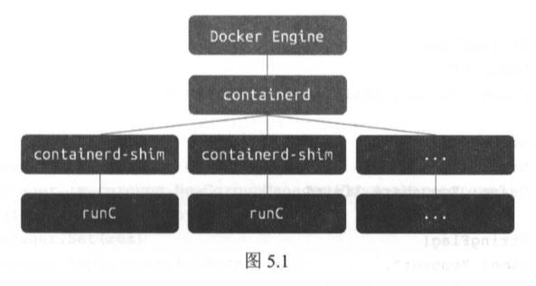
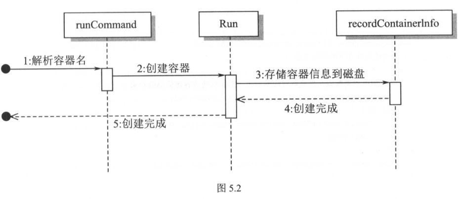
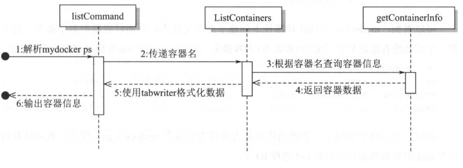

# Chapter 5:  Advanced Container Construction

## 1. Running a container in the background

* Docker uses ```runC```, a.k.a. ```containerd``` so that when the docker daemon is killed, the running containers are kept alive.

    

* We will use the ```detach``` function to enable ```mydocker``` to keep containers alive even after itself exits.

* A container is essentially a process from the OS's perspective. ```mydocker``` is the main process, and the container is a forked child process. The termination of the child and the executionf of the parent are asynchronous, i.e. the parent never knows when the child exits. If a parent is killed, then the child would be an orphaned process, and the ```init``` process (with pid=1) would take care of the child process.

* Testing:

    ```console
    $ ./mydocker run -d top
    INFO[0000] tty enabled: false                            source="5.1/main_command.go:69"
    INFO[0000] found subsystem's cgroupPath at /sys/fs/cgroup/cpuset/
    INFO[0000] found subsystem's cgroupPath at /sys/fs/cgroup/memory/
    INFO[0000] found subsystem's cgroupPath at /sys/fs/cgroup/cpu,cpuacct/
    INFO[0000] complete command is top                       source="5.1/run.go:54"
    ```

    * host: Note that in Ubuntu, ```/sbin/upstart``` handles some of the work of ```init``` in traditional Linux. Here top is handed to it.

    ```console
    $ ps -ef
    haiyang   2216  2199  0 00:36 ?        00:00:00 /sbin/upstart --user
    root     22548  2216  0 15:33 pts/4    00:00:00 top
    ```

## 2. Inspecting running containers

* Preparing data: we need to recored information about running containers. This might include its PID, container creation time, container's running command.

    * we write the container metadata into a ```json``` file at ```/var/run/mydocker/<containername>/config.json```

    * Program flow:

        

* ```docker ps```:

    * Program flow:

    

    * Testing:

        ```console
        $ ./mydocker run -d top
        INFO[0000] tty enabled: false                            source="5.2/main_command.go:73"
        INFO[0000] untared busybox.tar to /root/busybox          source="container/container_process.go:109"
        INFO[0000] created directory /root/writeLayer            source="container/container_process.go:121"
        INFO[0000] created directory /root/mnt/                  source="container/container_process.go:132"
        INFO[0000] "mount -t aufs -o dirs=/root/writeLayer:/root/busybox none /root/mnt/" successful  source="container/container_process.go:142"
        INFO[0000] using E874B774FB as container name            source="5.2/run.go:85"
        INFO[0000] written config file for container[Name: E874B774FB, ID: E874B774FB] to /var/run/mydocker/E874B774FB/config.json  source="5.2/run.go:123"
        INFO[0000] found subsystem's cgroupPath at /sys/fs/cgroup/cpuset/  source="subsystems/cpu_set.go:22"
        INFO[0000] found subsystem's cgroupPath at /sys/fs/cgroup/memory/  source="subsystems/memory.go:22"
        INFO[0000] found subsystem's cgroupPath at /sys/fs/cgroup/cpu,cpuacct/  source="subsystems/cpu.go:22"
        INFO[0000] finished setting up cgroup                    source="5.2/run.go:45"
        INFO[0000] complete command is top                       source="5.2/run.go:69"
        INFO[0000] "umount /root/mnt/" successful                source="container/container_process.go:221"
        INFO[0000] deleted directory /root/mnt/                  source="container/container_process.go:226"
        INFO[0000] deleted directory /root/writeLayer            source="container/container_process.go:236"

        $ ./mydocker run -d --name bird top
        INFO[0000] tty enabled: false                            source="5.2/main_command.go:73"
        INFO[0000] /root/busybox already exists, skipping untar process  source="container/container_process.go:111"
        INFO[0000] created directory /root/writeLayer            source="container/container_process.go:121"
        INFO[0000] created directory /root/mnt/                  source="container/container_process.go:132"
        INFO[0000] "mount -t aufs -o dirs=/root/writeLayer:/root/busybox none /root/mnt/" successful  source="container/container_process.go:142"
        INFO[0000] using bird as container name                  source="5.2/run.go:85"
        INFO[0000] written config file for container[Name: bird, ID: 6304F850E5] to /var/run/mydocker/bird/config.json  source="5.2/run.go:123"
        INFO[0000] found subsystem's cgroupPath at /sys/fs/cgroup/cpuset/  source="subsystems/cpu_set.go:22"
        INFO[0000] found subsystem's cgroupPath at /sys/fs/cgroup/memory/  source="subsystems/memory.go:22"
        INFO[0000] found subsystem's cgroupPath at /sys/fs/cgroup/cpu,cpuacct/  source="subsystems/cpu.go:22"
        INFO[0000] finished setting up cgroup                    source="5.2/run.go:45"
        INFO[0000] complete command is top                       source="5.2/run.go:69"
        INFO[0000] "umount /root/mnt/" successful                source="container/container_process.go:221"
        INFO[0000] deleted directory /root/mnt/                  source="container/container_process.go:226"
        INFO[0000] deleted directory /root/writeLayer            source="container/container_process.go:236"
        ```

        * host:

        ```console
        $ pwd
        /var/run/mydocker

        $ tree
        .
        ├── bird
        │   └── config.json
        └── E874B774FB
            └── config.json

        # navigate to mydocker directory
        $ /.mydocker ps
        ID           NAME         PID         STATUS      COMMAND     CREATED
        E874B774FB   E874B774FB   22168       Running     top         2018-07-20 12:01:44
        6304F850E5   bird         22202       Running     top         2018-07-20 12:02:17
        ```