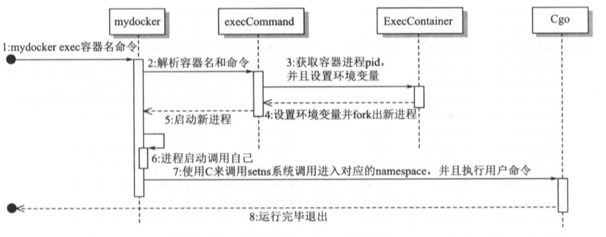
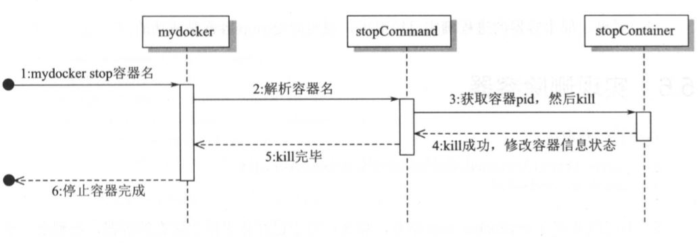

# Chapter 5:  Advanced Container Construction

## 1. Running a container in the background

* Docker uses ```runC```, a.k.a. ```containerd``` so that when the docker daemon is killed, the running containers are kept alive.

    

* We will use the ```detach``` function to enable ```mydocker``` to keep containers alive even after itself exits.

* A container is essentially a process from the OS's perspective. ```mydocker``` is the main process, and the container is a forked child process. The termination of the child and the executionf of the parent are asynchronous, i.e. the parent never knows when the child exits. If a parent is killed, then the child would be an orphaned process, and the ```init``` process (with pid=1) would take care of the child process.

* Testing:

    ```console
    $ ./mydocker run -d top
    INFO[0000] tty enabled: false                            source="5.1/main_command.go:69"
    INFO[0000] found subsystem's cgroupPath at /sys/fs/cgroup/cpuset/
    INFO[0000] found subsystem's cgroupPath at /sys/fs/cgroup/memory/
    INFO[0000] found subsystem's cgroupPath at /sys/fs/cgroup/cpu,cpuacct/
    INFO[0000] complete command is top                       source="5.1/run.go:54"
    ```

    * host: Note that in Ubuntu, ```/sbin/upstart``` handles some of the work of ```init``` in traditional Linux. Here top is handed to it.

    ```console
    $ ps -ef
    haiyang   2216  2199  0 00:36 ?        00:00:00 /sbin/upstart --user
    root     22548  2216  0 15:33 pts/4    00:00:00 top
    ```

## 2. Inspecting running containers

* Preparing data: we need to recored information about running containers. This might include its PID, container creation time, container's running command.

    * we write the container metadata into a ```json``` file at ```/var/run/mydocker/<containername>/config.json```

    * Program flow:

        

* ```docker ps```:

    * Program flow:

    

    * Testing:

        ```console
        $ ./mydocker run -d top
        INFO[0000] tty enabled: false                            source="5.2/main_command.go:73"
        INFO[0000] untared busybox.tar to /root/busybox          source="container/container_process.go:109"
        INFO[0000] created directory /root/writeLayer            source="container/container_process.go:121"
        INFO[0000] created directory /root/mnt/                  source="container/container_process.go:132"
        INFO[0000] "mount -t aufs -o dirs=/root/writeLayer:/root/busybox none /root/mnt/" successful  source="container/container_process.go:142"
        INFO[0000] using E874B774FB as container name            source="5.2/run.go:85"
        INFO[0000] written config file for container[Name: E874B774FB, ID: E874B774FB] to /var/run/mydocker/E874B774FB/config.json  source="5.2/run.go:123"
        INFO[0000] found subsystem's cgroupPath at /sys/fs/cgroup/cpuset/  source="subsystems/cpu_set.go:22"
        INFO[0000] found subsystem's cgroupPath at /sys/fs/cgroup/memory/  source="subsystems/memory.go:22"
        INFO[0000] found subsystem's cgroupPath at /sys/fs/cgroup/cpu,cpuacct/  source="subsystems/cpu.go:22"
        INFO[0000] finished setting up cgroup                    source="5.2/run.go:45"
        INFO[0000] complete command is top                       source="5.2/run.go:69"
        INFO[0000] "umount /root/mnt/" successful                source="container/container_process.go:221"
        INFO[0000] deleted directory /root/mnt/                  source="container/container_process.go:226"
        INFO[0000] deleted directory /root/writeLayer            source="container/container_process.go:236"

        $ ./mydocker run -d --name bird top
        INFO[0000] tty enabled: false                            source="5.2/main_command.go:73"
        INFO[0000] /root/busybox already exists, skipping untar process  source="container/container_process.go:111"
        INFO[0000] created directory /root/writeLayer            source="container/container_process.go:121"
        INFO[0000] created directory /root/mnt/                  source="container/container_process.go:132"
        INFO[0000] "mount -t aufs -o dirs=/root/writeLayer:/root/busybox none /root/mnt/" successful  source="container/container_process.go:142"
        INFO[0000] using bird as container name                  source="5.2/run.go:85"
        INFO[0000] written config file for container[Name: bird, ID: 6304F850E5] to /var/run/mydocker/bird/config.json  source="5.2/run.go:123"
        INFO[0000] found subsystem's cgroupPath at /sys/fs/cgroup/cpuset/  source="subsystems/cpu_set.go:22"
        INFO[0000] found subsystem's cgroupPath at /sys/fs/cgroup/memory/  source="subsystems/memory.go:22"
        INFO[0000] found subsystem's cgroupPath at /sys/fs/cgroup/cpu,cpuacct/  source="subsystems/cpu.go:22"
        INFO[0000] finished setting up cgroup                    source="5.2/run.go:45"
        INFO[0000] complete command is top                       source="5.2/run.go:69"
        INFO[0000] "umount /root/mnt/" successful                source="container/container_process.go:221"
        INFO[0000] deleted directory /root/mnt/                  source="container/container_process.go:226"
        INFO[0000] deleted directory /root/writeLayer            source="container/container_process.go:236"
        ```

        * host:

        ```console
        $ pwd
        /var/run/mydocker

        $ tree
        .
        ├── bird
        │   └── config.json
        └── E874B774FB
            └── config.json

        # navigate to mydocker directory
        $ /.mydocker ps
        ID           NAME         PID         STATUS      COMMAND     CREATED
        E874B774FB   E874B774FB   22168       Running     top         2018-07-20 12:01:44
        6304F850E5   bird         22202       Running     top         2018-07-20 12:02:17
        ```

## 3. Checking container logs

* We can redirect the ```stdout``` of the container process to ```/var/run/mydocker/<containername>/container.log```, and use ```mydocker logs``` to read and print its contents.

* Test:

    ```console
    # omitting the log info
    $ ./mydocker run -d --name bird top

    $ ./mydocker ps
    ID           NAME        PID         STATUS      COMMAND     CREATED
    7EB62FF000   bird        1922        Running     top         2018-07-20 15:50:57

    $ ./mydocker logs bird
    Mem: 1885392K used, 155628K free, 55092K shrd, 40312K buff, 347648K cached
    CPU: 20.5% usr  3.8% sys  0.0% nic 75.4% idle  0.1% io  0.0% irq  0.0% sirq
    Load average: 1.35 1.45 1.34 2/563 5
    PID  PPID USER     STAT   VSZ %VSZ CPU %CPU COMMAND
    ```

## 4. Re-entering container namespace

* Try to realize the ```mydocker exec``` function to re-enter a container after its creation.

* ```setns``` is a syscall to re-enter a desginated namespace according to a given PID. It opens the files under ```/proc/[pid]/ns/``` and enables the current process to enter a given namespace. However for Go-lang, a multi-threaded process cannot use ```setns``` to enter the ```Mount``` namespace and each time Go starts a program it enters multi-threaded mode, and we can't directly call ```setns```.

* ```Cgo``` enables Go programs to call C functions and standard libraries.

    * The two environmental variables determine if the embedded ```C``` function would truly run. If yes, it will run before the Go program's environment is initialized, avoiding the fact that multi-threaded Go programs cannot enter the ```Mount``` namespace.

    * ```/proc/self/exe exec``` (i.e. ```mydocker exec```) forks itself, but this execution differs from the program's initial execution, with the environmental variabels set this time, and we are able to let the C code enter the corresponding namespaces.

* Program flow:

    * 

* Testing:

    ```console
    $ ./mydocker run --name bird -d top
    nsenter: missing mydocker_pid env, skipping nsenter
    INFO[0000] tty enabled: false                            source="5.4/main_command.go:74"
    INFO[0000] untared busybox.tar to /root/busybox          source="container/container_process.go:124"
    INFO[0000] created directory /root/writeLayer            source="container/container_process.go:136"
    INFO[0000] created directory /root/mnt/                  source="container/container_process.go:147"
    INFO[0000] "mount -t aufs -o dirs=/root/writeLayer:/root/busybox none /root/mnt/" successful  source="container/container_process.go:157"
    INFO[0000] using bird as container name                  source="5.4/run.go:85"
    INFO[0000] written config file for container[Name: bird, ID: 6E0666B20B] to /var/run/mydocker/bird/config.json  source="5.4/run.go:123"
    INFO[0000] found subsystem's cgroupPath at /sys/fs/cgroup/cpuset/  source="subsystems/cpu_set.go:22"
    INFO[0000] found subsystem's cgroupPath at /sys/fs/cgroup/memory/  source="subsystems/memory.go:22"
    INFO[0000] found subsystem's cgroupPath at /sys/fs/cgroup/cpu,cpuacct/  source="subsystems/cpu.go:22"
    INFO[0000] finished setting up cgroup                    source="5.4/run.go:45"
    INFO[0000] complete command is top                       source="5.4/run.go:69"

    $ ./mydocker ps
    nsenter: missing mydocker_pid env, skipping nsenter
    ID           NAME        PID         STATUS      COMMAND     CREATED
    6E0666B20B   bird        25398       Running     top         2018-07-23 15:45:26

    $ ./mydocker exec bird sh
    nsenter: missing mydocker_pid env, skipping nsenter
    INFO[0000] exec container: container PID is 25398        source="5.4/exec.go:29"
    INFO[0000] exec container: command is sh                 source="5.4/exec.go:30"
    nsenter: got mydocker_pid = 25398
    nsenter: got mydocker_cmd = sh
    nsenter: setns on ipc namespace success
    nsenter: setns on uts namespace success
    nsenter: setns on net namespace success
    nsenter: setns on pid namespace success
    nsenter: setns on mnt namespace success
    / # ps -ef
    PID   USER     TIME  COMMAND
        1 root      0:00 top
        7 root      0:00 sh
        8 root      0:00 ps -ef
    / # exit

    # note that we can show the root directory of busybox here
    $ ./mydocker exec bird "ls -l"
    nsenter: missing mydocker_pid env, skipping nsenter
    INFO[0000] exec container: container PID is 26358        source="5.4/exec.go:29"
    INFO[0000] exec container: command is ls -l              source="5.4/exec.go:30"
    nsenter: got mydocker_pid = 26358
    nsenter: got mydocker_cmd = ls -l
    nsenter: setns on ipc namespace success
    nsenter: setns on uts namespace success
    nsenter: setns on net namespace success
    nsenter: setns on pid namespace success
    nsenter: setns on mnt namespace success
    total 40
    drwxr-xr-x    2 root     root         12288 May 22 17:00 bin
    drwxr-xr-x    2 root     root            40 Jul 23 07:54 dev
    drwxr-xr-x    3 root     root          4096 Jul 16 02:26 etc
    drwxr-xr-x    2 nobody   nogroup       4096 May 22 17:00 home
    dr-xr-xr-x  213 root     root             0 Jul 23 07:54 proc
    drwx------    2 root     root          4096 May 22 17:00 root
    drwxr-xr-x    2 root     root          4096 Jul 16 02:26 sys
    drwxrwxrwt    2 root     root          4096 May 22 17:00 tmp
    drwxr-xr-x    3 root     root          4096 May 22 17:00 usr
    drwxr-xr-x    4 root     root          4096 May 22 17:00 var

    ```
## 5. Stopping a container

* Goal is to find a container's PID and send a ```SIGTERM``` signal.

* Steps:

    1. Get container's PID

    2. Send ```kill``` signal to the PID

    3. Modify container's info

    4. Rewrite into the config file

* Program flow:

    

* Test:

    ```console
    $ ./mydocker run --name bird -d top
    nsenter: missing mydocker_pid env, skipping nsenter
    INFO[0000] tty enabled: false                            source="5.5/main_command.go:74"
    INFO[0000] untared busybox.tar to /root/busybox          source="container/container_process.go:124"
    INFO[0000] created directory /root/writeLayer            source="container/container_process.go:136"
    INFO[0000] created directory /root/mnt/                  source="container/container_process.go:147"
    INFO[0000] "mount -t aufs -o dirs=/root/writeLayer:/root/busybox none /root/mnt/" successful  source="container/container_process.go:157"
    INFO[0000] using bird as container name                  source="5.5/run.go:85"
    INFO[0000] written config file for container[Name: bird, ID: 90EAE7159C] to /var/run/mydocker/bird/config.json  source="5.5/run.go:123"
    INFO[0000] found subsystem's cgroupPath at /sys/fs/cgroup/cpuset/  source="subsystems/cpu_set.go:22"
    INFO[0000] found subsystem's cgroupPath at /sys/fs/cgroup/memory/  source="subsystems/memory.go:22"
    INFO[0000] found subsystem's cgroupPath at /sys/fs/cgroup/cpu,cpuacct/  source="subsystems/cpu.go:22"
    INFO[0000] finished setting up cgroup                    source="5.5/run.go:45"
    INFO[0000] complete command is top                       source="5.5/run.go:69"

    $ ./mydocker ps
    nsenter: missing mydocker_pid env, skipping nsenter
    ID           NAME        PID         STATUS      COMMAND     CREATED
    90EAE7159C   bird        14229       Running     top         2018-07-24 14:06:20

    $ ps -ef | grep top
    root     14229  2693  0 14:06 pts/1    00:00:00 top

    $ ./mydocker stop bird
    nsenter: missing mydocker_pid env, skipping nsenter
    INFO[0000] sent kill command to container bird with pid 14229  source="5.5/stop.go:33"
    INFO[0000] overwritten config file /var/run/mydocker/bird/config.json  source="5.5/stop.go:52"

    $ ./mydocker ps
    nsenter: missing mydocker_pid env, skipping nsenter
    ID           NAME        PID         STATUS      COMMAND     CREATED
    90EAE7159C   bird                    Stopped     top         2018-07-24 14:06:20
    ```

## 6. Deleting a container

* Steps:

    1. Find the container according to the name given

    2. Determine if the container is running

    3. Find the config file location and delete all files

* Test: if we continue from section 5

    ```console
    $ ./mydocker rm bird

    $ ./mydocker ps
    nsenter: missing mydocker_pid env, skipping nsenter
    ID          NAME        PID         STATUS      COMMAND     CREATED
    ```